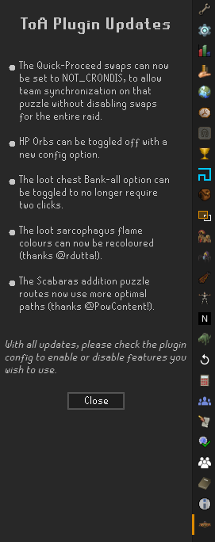
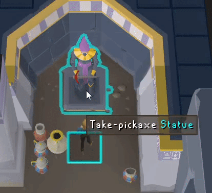
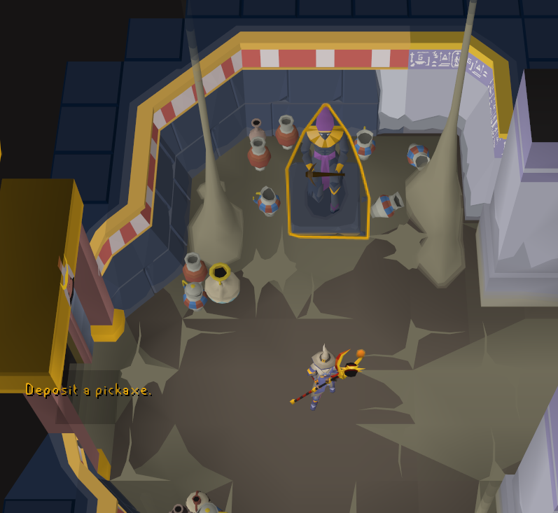
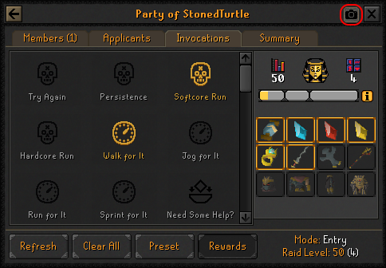
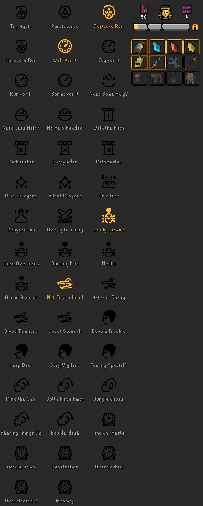

# Tombs of Amascut

Utilities and information for raiding the Tombs of Amascut.

## Features

Miscellaneous

### 🚀 Quick Proceed
Swaps all left-click "Enter", "Pass", etc. options
to be left-click "Quick-Enter", "Quick-Pass", etc.

This behaviour may not be desired for large groups at the Crondis (tree watering) puzzle.
For this case, you can choose the "Not Crondis" option, which will only disable quick-pass
for the Crondis puzzle's entrance.

### 🚀 HP Orbs

Allows removing the team member HP orbs altogether,
or replacing them with linear health bars.

### 🚀 Show Updates

Displays an update panel with a changelog upon entering the ToA lobby
after major plugin updates.

### 🚀 Salts Cooldown

Prevents wasting smelling salts by adding a cooldown to the Crush option.

Akkha

### 🚀 Shadows Hp Overlay

Displays the current health of Akkha's shadows.
Font style and size can be controlled by the matching options.

Kephri

### 🚀 Swarmer

Displays wave numbers on scarab swarms in the kephri room as they spawn.
The side panel will show logs of previous raid's leaked swarms.
Font color, style and size can be controlled by the matching options.

Path of Apmeken

### 🕰️ Apmeken Wave Helper (legacy)

This feature displays a static list of wave spawns on the side panel.
It is included as a legacy option from prior to Jagex allowing more immersive plugins
within the Tombs of Amascut.

### 🚀 Baboon Outline

Highlights each baboon type within the Path of Apmeken as its own colour.
The highlight style and colour for each baboon can be controlled by the matching options.
To disable a specific type of baboon highlighting, set its opacity to 0.
Baboon thralls are not highlighted by default.

### 🚀 Volatile Baboon Radius

Highlights the explosion area around each Volatile Baboon.
The colour can be controlled by the matching option.

Path of Het

### 🚀 Beam Timer

Displays a timer on the Caster statue indicating when the light beam will be cast.
Clicking on Het's seal the tick prior to the beam being cast 
(when the indicator is green) will enable you to get an extra hit on the seal. 
In solos, this can be used for a consistent "1-down".

### 🚀 Mirror Puzzle Solver

Displays solutions for the mirror puzzle by showing
which breakable walls need to be broken,
where to place movable mirrors,
and which dirty mirrors require cleaning.
Place mirrors on the marked tiles with the reflective face 
aligned with the filled-in portion of the red triangle.

### 🚀 Deposit-pickaxe Swap

While holding a pickaxe, swaps the left-click option to "Deposit-pickaxe"
on the statue in the mirror puzzle room.

### 🚀 Pickaxe Reminders

Prevent Room Exit and Prevent Raid Start remove the left-click options
to leave the Path of Het or begin a raid, respectively, 
until you have deposited your pickaxe into the holder statue.
To override, use the right-click menu on the entryway.

A visual warning can also be enabled for each with the matching option.

Path of Scabaras

### 🚀 Puzzle Helpers

#### Addition Puzzle

Highlights a path through the tiles that will add up to the target number.

#### Lights

Shows the tiles that need to be flipped to solve the puzzle.

#### Obelisks

Highlights the correct obelisk pattern as it is discovered by the player.

#### Sequence

Shows the tile sequence after the pattern is shown.

#### Matching

Highlights each tile image a unique colour after it has been flipped once.

Burial Tomb

### 🚀 Bank-all Single Click

Allows banking all loot with a single left-click on the bank option,
instead of requiring a submenu selection.

### 🚀 Purple Chest Audio

This will play a `.wav` audio file from your local machine whenever 
the Tombs of Amascut Sarcophagus is opened (the purple chest).
Volume can be controlled by the matching option.

#### Setup
1. Open your `.runelite/tombs-of-amascut` folder
    * On Windows, `C:\Users\<pcname>\.runelite\tombs-of-amascut` or `%USERPROFILE%\.runelite\tombs-of-amascut`
    * On macOS and Linux, `~/.runelite/tombs-of-amascut`
2. Add your sound file
    * The file should be named `toa-chest.wav` and only `.wav` files are supported.
    * The entirety of the file will be played, it is recommended to limit this file to 30 seconds.

### 🚀 Recolour Options

Allows recolouring the sarcophagus' flames based on whether there was 
no unique reward,  a unique reward for you, or a unique reward for another player.

### 🚀 Detect Cursed Phalanx

Prevents opening any raid loot chests while carrying or wielding a cursed phalanx,
or corresponding ornamented Osmumten's fang, on raid levels 500 or above.
This is to allow collecting duplicates, which otherwise will not appear in the loot.

### 🚀 Track Purple Dry Count

Shows a count after opening the loot chest of how many raids since seeing your last
unique drop. Team member unique drops are included, and reset the counter.

Points Tracker

### 🚀 Points Tracker

Tracks an estimate of the raid points earned, 
which directly controls both unique and common loot.
The on-screen overlay can be enabled and configured using the matching options.

### 🚀 Points Total Message

Displays the raid point totals in chat after leaving the burial tomb,
similar to the Chambers of Xeric message.

### 🚀 Send to External Plugins

Allows other locally installed plugins to receive points data at the end of raids.
As of writing, the only plugin which consumes this data is Raid Data Tracker.

 🕰️ Invocation Presets (legacy)

This feature predates the implementation of vanilla invocation presets.
Right-click the in-game "Presets" button to save or load presets.
Since the plugin cannot interact with the UI on your behalf, 
it instead displays which invocations need to be toggled.

Use shift+right-click to delete presets.

Invocation Screenshot

Adds a button to the ToA Invocations Interface that will 
copy all of your invocations as a picture to your system clipboard.
This image will also include the rewards section if it's enabled 
and the button is selected within the in-game interface.

Whether to use the currently-installed resource pack
(from the Resource Packs plugin)
can be toggled using the matching option.

Time Tracking

### 🚀 Target Time in Timer

Adds the selected target time invocation to the vanilla timer overlay.

### 🚀 Splits

Shows per-room or per-path timer splits as an overlay,
or as a chat message at the end of the raid.

