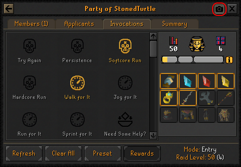

# Tombs of Amascut

Utilities and information for raiding the Tombs of Amascut.

**Note: While Tombs of Amascut is new, Jagex will be quite strict on what is and is not allowed in ToA plugins.**
Feel free to request new features in the Issues tab (after searching for an existing matching issue),
or follow a discussion there on whether a feature should be implemented.

### Current Features

#### Invocation Presets

Right-click the Preset button to create/load/import/export presets.
Invocations that need to be changed will be highlighted green/red.
Shift+right-click to delete presets.

#### Deposit-pickaxe Swap

While holding a pickaxe, swaps the left-click option to "Deposit-pickaxe"
on the statue in the mirror puzzle room.

#### Invocation Screenshot
Adds a button to ToA Invocation Interface that when clicked will copy all of your invocations as a picture to your system clipboard.
This image will also include the rewards section if it's enabled via the config options and the button is selected within the in-game interface.

[Click here to see an example of the screenshot that will be created](docs/screenshot-example.png)

#### Scabaras Tile Puzzle Helper

When entering the Path of Scabaras, opens a side panel
with solutions for the numbered tiles puzzle.

#### Apmeken Wave Helper

When entering the Path of Apmeken, opens a side panel
with a list of the baboon wave spawns.

